<div align="center">

# 🗡️ Hollow Knight — Java/libGDX Remake

### A faithful recreation of Team Cherry's Hollow Knight, built from scratch in Java

[](https://openjdk.org/projects/jdk/21/)
[](https://libgdx.com/)
[](https://libgdx.com/wiki/extensions/box2d)
[](https://gradle.org/)
[](LICENSE)

**[🎬 Video Demo](#)** · **[📥 Download](#-installation)** · **[📖 Documentation](#-architecture)** · **[🗺️ Map Showcase](#-maps)**

</div>

---

## 📋 Table of Contents

- [Overview](#-overview)
- [Key Features](#-key-features)
- [Tech Stack](#-tech-stack)
- [Architecture](#-architecture)
- [Design Patterns](#-design-patterns)
- [Project Structure](#-project-structure)
- [Knight — Movements & Abilities](#-knight--movements--abilities)
- [Enemies](#-enemies)
- [Enemy Animations](#-enemy-animations)
- [Maps](#-maps)
- [Charm System](#-charm-system)
- [HUD System](#-hud-system)
- [Save System](#-save-system)
- [Installation](#-installation)
- [Screenshots](#-screenshots)
- [Credits](#-credits)

---

## 🌟 Overview

This project is a **complete, ground-up recreation** of Hollow Knight's core gameplay using **Java** and **libGDX**. It features a full physics engine (Box2D), a state-machine-driven AI system for multiple enemy types and a boss, Tiled map integration, a charm system, save/load functionality, localization (English/French), and a polished HUD with animated health and soul meters.

The codebase demonstrates advanced software engineering principles through the systematic application of **11+ design patterns**, a clean MVC architecture, and a modular entity-component system.

---

## 🎯 Key Features

| Feature | Details |
|---|---|
| **Physics Engine** | Full Box2D integration with gravity, collision detection, sensor bodies, and bitmask filtering |
| **State Machine AI** | 60+ unique states across Knight, 5 enemy types, Boss, NPC, and Camera |
| **Boss Fight** | Phase-based False Knight boss with dynamic attack selection, armor removal, and stun mechanics |
| **Charm System** | 6 equippable charms that modify gameplay (Quick Slash, Heavy Blow, Sharp Shadow, etc.) |
| **Spells** | Vengeful Spirit (Soul & Shadow), Howling Wraiths (AOE), Focus (Heal) |
| **Pogo System** | Down-slash bouncing off enemies and spikes |
| **Wall Mechanics** | Wall sliding, wall jumping |
| **3 Unique Maps** | Crystal Peaks, City of Tears, Boss Arena — each with distinct enemies, music, and tilesets |
| **Save System** | JSON-based save slots with full game state serialization |
| **Localization** | English & French support with runtime language switching |
| **Settings** | Re-bindable keys, volume controls, brightness adjustment |
| **Achievements** | Achievement system tracking player milestones |
| **Cheat Codes** | Developer console with god mode, noclip, insta-kill, teleport, and more |
| **Animated HUD** | Animated heart icons with break/refill animations, FrameBuffer-based soul meter |

---

## 🛠️ Tech Stack

| Layer | Technology | Purpose |
|---|---|---|
| Language | **Java 21** | Core language with modern features (records, sealed classes) |
| Framework | **libGDX 1.14.2** | Cross-platform game framework |
| Physics | **Box2D (gdx-box2d)** | 2D rigid-body physics simulation |
| Backend | **LWJGL3 3.4.1** | Desktop OpenGL backend |
| Fonts | **gdx-freetype** | Dynamic font rendering |
| UI | **TenPatch 5.2.3** | Nine-patch UI components |
| Level Design | **Tiled** | Orthogonal TMX maps with 8×8 tile size |
| Build | **Gradle** | Multi-module build system with construo packaging |
| Native | **GraalVM** | Optional native-image compilation |

---

## 🏗️ Architecture

### High-Level Architecture

```
┌─────────────────────────────────────────────────────────────────┐
│                        Lwjgl3Launcher                           │
│                         (Desktop Entry)                         │
└──────────────────────────┬──────────────────────────────────────┘
                           │
                           ▼
┌─────────────────────────────────────────────────────────────────┐
│                           Main (Game)                           │
│                   ┌──────────┴──────────┐                       │
│                   │    MainController   │                        │
│                   │  (Asset Loading)    │                        │
│                   └─────────────────────┘                       │
└──────────────────────────┬──────────────────────────────────────┘
                           │
              ┌────────────┴────────────┐
              ▼                         ▼
┌─────────────────────┐    ┌─────────────────────┐
│     MainScreen      │    │     GameScreen       │
│   (Menu / UI)       │    │  (Game World Loop)   │
└─────────────────────┘    └──────────┬──────────┘
                                      │
                    ┌─────────────────┼─────────────────┐
                    ▼                 ▼                  ▼
           ┌──────────────┐  ┌──────────────┐  ┌──────────────┐
           │  GameController │  │  GameSession │  │  GameHUD     │
           │  (Update Loop) │  │  (Singleton) │  │  (UI Overlay)│
           └───────┬──────┘  └──────────────┘  └──────────────┘
                   │
    ┌──────────────┼──────────────────────────┐
    ▼              ▼                          ▼
┌────────┐  ┌───────────┐          ┌──────────────────┐
│ Knight │  │  Enemies  │          │   Projectiles    │
│(16 states)│ │(5 types) │          │(Vengeful, Wave) │
└────────┘  └───────────┘          └──────────────────┘
    │              │
    ▼              ▼
┌──────────────────────────────────────────────────┐
│              Box2D World (Physics)                │
│   ┌──────────────────────────────────────────┐   │
│   │  GameContactListener (9 Sub-Listeners)   │   │
│   └──────────────────────────────────────────┘   │
└──────────────────────────────────────────────────┘
```

### Class Hierarchy

```
Entitie (Abstract)
├── Knight                    ── Player character (16 states)
├── Enemy (Abstract)
│   ├── GroundEnemy           ── Patrol AI (Crawlid, Tiktik, CrystalCrawler)
│   ├── HuskHornheadEnemy     ── Aggressive ground enemy (5 states)
│   ├── WingedSentry          ── Flying charger (4 states)
│   ├── CrystalGuardian       ── Ranged laser enemy (6 states)
│   ├── FalseKnightEnemy      ── Boss (10 states, 2 phases)
│   └── Zote                  ── NPC with dialogue system (4 states)
└── Projectile (Abstract)
    ├── VengefulProjectile    ── Horizontal soul/shadow ball
    └── WaveProjectile        ── AOE shockwave
```

---

## 🎨 Design Patterns

This project implements **11+ design patterns**, each chosen to solve specific architectural challenges.

---

### 1. Singleton Pattern

**Purpose**: Ensure a single, globally accessible instance of critical game systems.

| Class | File | Role |
|---|---|---|
| `GameSession` | `Model/GameSession.java:18-46` | Central game state (map, world, knight, enemies) |
| `CameraSession` | `Utils/camera/CameraSession.java:10-27` | Camera state machine manager |
| `AudioManager` | `Utils/audio/AudioManager.java:11-34` | Sound & music playback |
| `Main` | `Main.java:17-22` | Application entry point |
| `Assets` | `Model/Assets.java:6` | Shared asset manager (eager) |

```java
// GameSession — Lazy Singleton
private static GameSession gameSession;
private GameSession() { ... }
public static GameSession getInstance() {
    if (gameSession == null) gameSession = new GameSession();
    return gameSession;
}
```

---

### 2. Factory Pattern

**Purpose**: Decouple entity creation from usage; centralize spawning logic.

| Factory | File | Creates |
|---|---|---|
| `EnemyFactory` | `Model/entities/enemies/EnemyFactory.java:13-32` | 7 enemy types via string type |
| `ProjectileFactory` | `Model/entities/projectiles/ProjectileFactory.java:12-31` | Soul/Shadow projectiles, Wave |

```java
// EnemyFactory — Static Factory Method
public static Enemy createEnemy(String type, World world, float x, float y) {
    switch (type) {
        case "Crawlid":        return new GroundEnemy(world, x, y, ...);
        case "FalseKnight":    return new FalseKnightEnemy(world, x, y, 100);
        // ...
    }
}
```

---

### 3. State Pattern

**Purpose**: Manage complex entity behavior through discrete, encapsulated states. The most extensively used pattern with **60+ concrete states** across 8 independent state machines.

**Knight State Machine (16 states)**:
```
KnightState (abstract)
├── KnightIdleState          ── Standing still
├── KnightRunState           ── Horizontal movement
├── KnightJumpState          ── Jump + double jump
├── KnightFallState          ── Falling + landing
├── KnightAttackState        ── Slash / UpSlash / DownSlash
├── KnightDashState          ── Quick dash
├── KnightShadowDashState    ── Dash through enemies
├── KnightPogoJumpState      ── Down-slash bounce
├── KnightKnockbackState     ── Hit reaction (wraps previous state)
├── KnightDeathState         ── Death + respawn
├── KnightFocusState         ── Heal (spend soul)
├── KnightVengefulSpiritState── Fireball spell
├── KnightHowlingWraiths     ── AOE scream
├── KnightWallSideState      ── Wall slide + wall jump
├── KnightOnSpikesState      ── Spike damage
└── KnightSpectatorModeState ── Noclip (cheat)
```

**False Knight Boss State Machine (10 states)**:
```
FalseKnightState (abstract)
├── FalseIdleState           ── AI decision tree (sensor-based)
├── FalseMaceSlamState       ── Close-range slam
├── FalseChargeMaceSlamState ── Charge + slam (Phase 2 only)
├── FalseChargeRunState      ── Run toward knight
├── FalseOffensiveLeapState  ── Jump toward knight
├── FalseDefensiveLeapState  ── Jump away
├── FalseKnockbackState      ── Hit reaction (wrapper)
├── FalseStunState           ── Armor removal (5 sub-phases)
└── FalseDeathState          ── Death sequence
```

---

### 4. Observer Pattern

**Purpose**: Decouple collision detection through a multicast listener system.

**File**: `Model/contacts/GameContactListener.java:12-44`

```java
public class GameContactListener implements ContactListener {
    public ArrayList<ContactListener> listeners;  // 9 observers

    public void beginContact(Contact contact) {
        for (ContactListener listener : listeners)
            listener.beginContact(contact);       // broadcast
    }
}
```

**9 Specialized Listeners**:
1. `KnightContactListener` — Knight sensor management
2. `GlobalContactListener` — Damage, spikes, teleports
3. `GroundEnemyListener` — Ground patrol sensors
4. `FlyingEnemyListener` — Flying enemy sensors
5. `HuskEnemyListener` — Husk Hornhead sensors
6. `CrystalEnemyListener` — Crystal Guardian sensors
7. `FalseKnightListener` — Boss distance sensors
8. `ZoteContactListener` — NPC proximity
9. `ProjectileContactListener` — Projectile collision

---

### 5. Template Method Pattern

**Purpose**: Define algorithmic skeletons in base classes, allowing subclasses to override specific steps.

All state base classes implement this pattern:
```java
// KnightState.java — Template Method
public abstract class KnightState {
    public void enter(Knight knight) {
        stateTime = 0f;           // Fixed: reset timer
        this.knight = knight;     // Fixed: store reference
        this.body = knight.getBody();
        // Subclass adds specific setup (create animation, apply velocity)
    }
    public void update(float delta) {
        stateTime += delta;       // Fixed: accumulate time
        // Subclass adds specific logic
    }
}
```

Also applied in: `AbstractScreen` (screen lifecycle), all enemy state base classes.

---

### 6. Decorator / Wrapper Pattern

**Purpose**: Wrap an existing state with additional behavior (knockback) without modifying it.

**File**: `KnightKnockbackState.java:14-115`

```java
public class KnightKnockbackState extends KnightState {
    private KnightState stateWrapper;  // wrapped state

    public KnightKnockbackState(Body enemyBody, Knight knight, KnightState lastState, float strength) {
        this.stateWrapper = lastState;  // wrap the previous state
    }

    public void update(float delta) {
        if (timer < knockDuration) return;    // knockback behavior
        stateWrapper.update(delta);            // delegate to wrapped state
    }
}
```

Also used in: `FalseKnockbackState` for the boss.

---

### 7. Strategy Pattern

**Purpose**: Dynamically modify entity behavior based on equipped charms.

| Charm | File | Effect |
|---|---|---|
| `QUICK_SLASH` | `KnightAttackState.java:35-36` | Attack speed ×2 |
| `HEAVY_BLOW` | `KnightAttackState.java:159-163` | Knockback +5 |
| `UNBREAKABLE_STRENGTH` | `KnightAttackState.java:162-163` | Damage +5 |
| `SHARP_SHADOW` | `KnightDashState.java:22-25` | Dash becomes Shadow Dash |
| `QUICK_FOCUS` | `KnightFocusState.java:32` | Heal speed ×2 |
| `VOID_HEART` | `KnightVengefulSpiritState.java:33-37` | Soul → Shadow spells |
| `DASHMASTER` | `Knight.java:195` | Dash cooldown 1s → 0.1s |

---

### 8. Composite Pattern

**Purpose**: Treat individual objects and compositions uniformly.

- `GameContactListener` — Composite of 9 contact listeners, treated as a single `ContactListener`
- `AbstractScreen` — UI stack (`Stack` → `Table` → actors) for modal overlays

---

### 9. Command Pattern

**Purpose**: Encapsulate operations as objects for input handling.

**File**: `Manager/CheatCodeManager.java:16-55`

```java
public static void handleCheats(Knight knight) {
    if (Gdx.input.isKeyJustPressed(CheatKeys.NOCLIP.getTriggerKey()))
        knight.changeState(new KnightSpectatorModeState());      // Command: Toggle noclip
    if (Gdx.input.isKeyJustPressed(CheatKeys.GOD_MODE.getTriggerKey()))
        knight.setOnGodMode(!knight.isOnGodMode());              // Command: Toggle god mode
    // ...
}
```

Also used in: `GameProcessor` for key → action mapping (Escape → pause, I → inventory).

---

### 10. Registry Pattern (Enum-Based)

**Purpose**: Type-safe registries for assets, maps, charms, and keys.

```java
// AnimationManager — All animation atlases registered as enum constants
public enum AnimationManager {
    Knight("animations/Atlas/Knight/Knight.atlas"),
    FalseKnight("animations/Atlas/Enemies/FalseKnight/FalseKnight.atlas"),
    // ... 16 total entries
}

// GameMap — Level registry
public enum GameMap {
    BOSSFITE("maps/BossFite/BossFite.tmx", "audio/BossFite.mp3"),
    CRYSTALPEAKS("maps/CrystalPeaks/CrystalPeaks.tmx", "audio/CrystalPeaks.mp3"),
    CITYOFTEARS("maps/CityOfTears/CityOfTears.tmx", "audio/CityOfTears.mp3");
}
```

---

### 11. Abstract Factory Pattern (Lightweight)

**Purpose**: Create families of related UI modals.

**Modal Hierarchy**:
```
Modal (abstract)
├── PauseModal          ── Continue / Settings / Guide / Exit
├── InventoryModal      ── Charm equipping UI
├── VictoryModal        ── Stats display
├── SettingModal        ── Volume, brightness, keys
├── SaveSlotsModal      ── Save/Load slots
├── GuideModal          ── Controls reference
└── AchievementsModal   ── Achievement list
```

---

### Pattern Summary

| Pattern | Instances | Key Files |
|---|---|---|
| Singleton | 5 | `GameSession`, `CameraSession`, `AudioManager`, `Main`, `Assets` |
| Factory | 2 | `EnemyFactory`, `ProjectileFactory` |
| State | 8 machines, 60+ states | Knight (16), FalseKnight (10), Crystal (6), Husk (5), Ground (4), Winged (4), Zote (4), Camera (4) |
| Observer | 1 multicast + 9 listeners | `GameContactListener` + sub-listeners |
| Template Method | 8 base classes | All `*State` base classes + `AbstractScreen` |
| Decorator/Wrapper | 2 | `KnightKnockbackState`, `FalseKnockbackState` |
| Strategy | 7 charm effects | `CharmEnum` checks in states |
| Composite | 2 | `GameContactListener`, UI Stack |
| Command | 2 | `CheatCodeManager`, `GameProcessor` |
| Registry | 4 | `AnimationManager`, `GameMap`, `CharmEnum`, `AudioStore` |
| Abstract Factory | 1 hierarchy | `Modal` and its 7 subclasses |

---

## 📁 Project Structure

```
HollowKnightNew/
├── build.gradle                           # Root build (Java 21, asset generation)
├── settings.gradle                        # Module registration
├── gradle.properties                      # Version constants
│
├── assets/                                # All game resources
│   ├── animations/Atlas/                  # Texture atlases per entity
│   │   ├── Knight/Knight.atlas
│   │   └── Enemies/FalseKnight/, Crawlid/, CrystalGuardian/, ...
│   ├── audio/                             # ~1,700 WAV/M4A files
│   ├── maps/                              # Tiled TMX levels + TSX tilesets
│   │   ├── CrystalPeaks/
│   │   ├── CityOfTears/
│   │   └── BossFite/
│   ├── sprites/                           # Static textures
│   ├── atlases/                           # UI atlases
│   └── ui/                                # Nine-patch styles, modals
│
├── core/src/main/java/Yousof/HollowKnight/
│   ├── Main.java                          # Game entry point (Singleton)
│   │
│   ├── Controller/
│   │   ├── MainController.java            # Asset pre-loading
│   │   └── GameController.java            # Game loop, map loading, entity spawning
│   │
│   ├── Model/
│   │   ├── GameSession.java               # Singleton: world, knight, enemies, stats
│   │   ├── Assets.java                    # Shared AssetManager
│   │   ├── entities/
│   │   │   ├── Entitie.java               # Abstract base entity
│   │   │   ├── knight/
│   │   │   │   ├── Knight.java            # Player: HP, soul, state machine, sensors
│   │   │   │   └── state/                 # 16 Knight states
│   │   │   ├── enemies/
│   │   │   │   ├── Enemy.java             # Abstract enemy base
│   │   │   │   ├── EnemyFactory.java      # Factory: 7 enemy types
│   │   │   │   ├── FalseKnight/           # Boss (10 states)
│   │   │   │   ├── CrystalGuardian/       # Laser enemy (6 states)
│   │   │   │   ├── FlyingEnemy/           # WingedSentry (4 states)
│   │   │   │   ├── HuskHornhead/          # Aggressive ground (5 states)
│   │   │   │   └── groundEnemy/           # Patrol enemy (4 states)
│   │   │   ├── projectiles/
│   │   │   │   ├── Projectile.java        # Abstract projectile
│   │   │   │   ├── ProjectileFactory.java # Factory: Soul/Shadow/Wave
│   │   │   │   ├── VengefulProjectile.java
│   │   │   │   └── WaveProjectile.java
│   │   │   └── npc/
│   │   │       └── Zote.java              # NPC with dialogue (4 states)
│   │   ├── contacts/
│   │   │   ├── GameContactListener.java   # Composite observer (9 listeners)
│   │   │   ├── KnightContactListener.java
│   │   │   ├── GlobalContactListener.java
│   │   │   └── ... (9 total listeners)
│   │   └── HUD/
│   │       ├── GameHUD.java               # Health + soul display
│   │       └── HeartIcon.java             # Animated hearts (4 states)
│   │
│   ├── Screen/
│   │   ├── AbstractScreen.java            # Template Method base
│   │   ├── Main/                          # Menu screens & modals
│   │   └── Game/
│   │       ├── GameScreen.java            # Main game render loop
│   │       ├── GameProcessor.java         # Input handling
│   │       └── GameState.java             # Pause/Run enum
│   │
│   ├── Manager/
│   │   ├── LocalizationManager.java       # EN/FR translations
│   │   ├── AchievementManager.java        # Achievement tracking
│   │   ├── CheatCodeManager.java          # Developer console
│   │   └── KnightInventory.java           # Charm management
│   │
│   ├── Utils/
│   │   ├── camera/
│   │   │   ├── CameraSession.java         # Camera state singleton
│   │   │   └── state/                     # 4 camera states
│   │   ├── audio/
│   │   │   └── AudioManager.java          # Music + SFX singleton
│   │   ├── animation/
│   │   │   └── AnimationManager.java      # Enum-based atlas registry
│   │   ├── save/
│   │   │   ├── SaveManager.java           # JSON persistence
│   │   │   └── GameData.java              # Save data structure
│   │   └── sensors/                       # Box2D sensor helpers
│   │
│   └── Enum/
│       ├── Constants.java                 # Physics, collision bits, PPM
│       ├── GameMap.java                   # Level registry
│       ├── Settings.java                  # Graphics settings
│       ├── KeysSettings.java              # Re-bindable keys
│       ├── AudioStore.java                # Sound file registry
│       ├── CharmEnum.java                 # Charm definitions
│       ├── CheatKeys.java                 # Cheat key bindings
│       ├── AchievementTypes.java          # Achievement definitions
│       ├── GameText.java                  # UI text keys
│       └── SupportedLanguages.java        # EN, FR
│
└── lwjgl3/src/main/java/.../
    ├── Lwjgl3Launcher.java                # Desktop main()
    └── StartupHelper.java                 # Native library extraction
```

---

## ⚔️ Knight — Movements & Abilities

The Knight has **16 distinct states** covering movement, combat, spells, and special abilities. Each state is fully animated with directional variants.

### Movement & Traversal

| # | Movement | GIF | Description |
|---|---|---|---|
| 1 | **Idle** |  | Standing still with breathing animation |
| 2 | **Run** |  | Horizontal movement with configurable speed |
| 3 | **Jump** |  | Vertical impulse with variable height (release early = shorter) |
| 4 | **Double Jump** |  | Second jump in mid-air resets vertical velocity |
| 5 | **Fall** |  | Falling state with landing detection |
| 6 | **Wall Slide** |  | Slows descent when touching a wall (80% velocity retention) |
| 7 | **Wall Jump** |  | Pushes away from wall with upward impulse |

### Combat — Melee

| # | Attack | GIF | Description |
|---|---|---|---|
| 8 | **Horizontal Slash** |  | Forward melee attack (left/right sensor detection) |
| 9 | **Up Slash** |  | Upward melee attack (overhead sensor detection) |
| 10 | **Down Slash (Pogo)** |  | Downward attack that bounces off enemies/spikes, resets dash & double jump |

### Combat — Dash

| # | Ability | GIF | Description |
|---|---|---|---|
| 11 | **Dash** |  | Quick horizontal burst (impulse ±12), locks Y velocity |
| 12 | **Shadow Dash** |  | Dash through enemies (Sharp Shadow charm), damages on contact, 1.4× speed |

### Combat — Spells

| # | Spell | GIF | Description |
|---|---|---|---|
| 13 | **Vengeful Spirit** |  | Horizontal fireball projectile (33 soul). Void Heart → Shadow version (8 damage) |
| 14 | **Howling Wraiths** |  | AOE scream damaging all nearby enemies (33 soul). Void Heart → 1.5× damage |

### Combat — Defensive

| # | Ability | GIF | Description |
|---|---|---|---|
| 15 | **Focus (Heal)** |  | Restore 1 mask by spending 33 soul. Three-phase animation with camera shake |
| 16 | **Knockback** |  | Hit reaction — wraps current state, applies knockback impulse, then resumes |

### Special States

| State | Description |
|---|---|
| **Death** | Death animation → fade out → respawn at last bench |
| **Spike Contact** | Damage + upward bounce when touching spikes |
| **Spectator Mode** | Noclip fly mode (cheat code: Ctrl+N) |

---

## 👾 Enemies

### Enemy Hierarchy

```
Enemy (Abstract)
├── GroundEnemy          ── Parameterized patrol enemies
│   ├── Crawlid          ── Slow, small bug
│   ├── Tiktik           ── Fast, small bug
│   └── CrystalCrawler   ── Crystal-infused crawler
├── HuskHornheadEnemy    ── Aggressive ground charger
├── WingedSentry         ── Flying horizontal charger
├── CrystalGuardian      ── Ranged laser enemy (enraged state)
├── FalseKnightEnemy     ── Boss: 100 HP, 2 phases, 8+ attacks
└── Zote (NPC)           ── Talkative NPC, killable (20 HP)
```

### Enemy AI Behaviors

| Enemy | States | AI Logic |
|---|---|---|
| **GroundEnemy** | Run → Turn → Knockback → Death | Patrol until cliff/wall, turn around |
| **HuskHornhead** | Idle → Run → Attack → Turn → Knockback → Death | Patrol + detect knight at range → charge |
| **WingedSentry** | Idle → Attack → Knockback → Death | Fly, detect knight → horizontal charge at 5× speed |
| **CrystalGuardian** | Enraged → Idle → Turn → Laser → Knockback → Death | Range-based laser attacks |
| **FalseKnight** | Idle → MaceSlam/Charge/Leap → Stun → Death | Sensor-based AI decision tree (see below) |

### False Knight — Boss AI Decision Tree

```
                    ┌─────────────┐
                    │  FalseIdle  │
                    └──────┬──────┘
                           │
            ┌──────────────┼──────────────┐
            ▼              ▼              ▼
       [Near Range]   [Mid Range]    [Far Range]
            │              │              │
     ┌──────┴──────┐  ┌───┴────┐   ┌─────┴─────┐
     │ MaceSlam    │  │Offensive│   │ ChargeRun  │
     │ (alternating)│ │Leap 60% │   │   (70%)    │
     │ Defensive   │  │Charge   │   │ ChargeMace │
     │ Leap        │  │Run 40%  │   │ Slam (30%) │
     └─────────────┘  └────────┘   │ Phase 2    │
                                    │ only       │
                                    └────────────┘
```

**Phase Transition**: At HP ≤ 50, armor falls off (dynamic body rebuild), speed doubles, `ChargeMaceSlam` unlocks.

---

## 🎬 Enemy Animations

Each enemy has multiple animated states. Below is a showcase of all enemy animations.

### Ground Enemies

| Enemy | Idle | Walk | Turn | Knockback | Death |
|---|---|---|---|---|---|
| **Crawlid** |  |  | 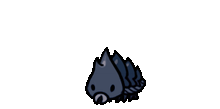 | 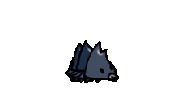 |  |
| **Tiktik** | 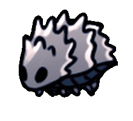 |  |  | 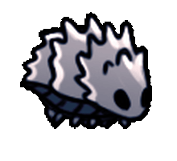 | 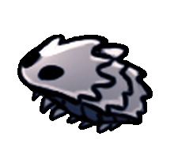 |
| **Crystal Crawler** | 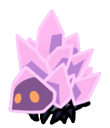 |  | 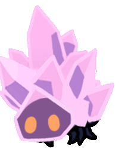 | 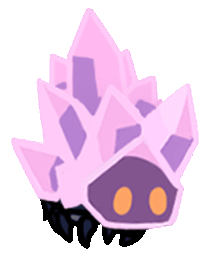 | 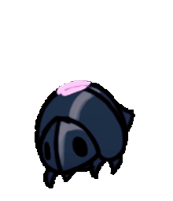 |

### Aggressive Enemies

| Enemy | Idle | Walk | Attack | Turn | Knockback | Death |
|---|---|---|---|---|---|---|
| **Husk Hornhead** |  |  |  | 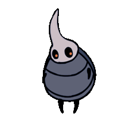 | 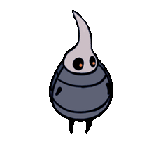 |  |

### Flying Enemies

| Enemy | Idle | Charge Antic | Charge | Knockback | Death |
|---|---|---|---|---|---|
| **Winged Sentry** |  | 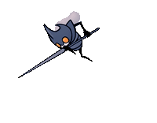 |  | 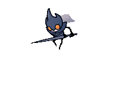 |  |

### Ranged Enemies

| Enemy | Enraged | Idle | Turn | Laser | Knockback | Death |
|---|---|---|---|---|---|---|
| **Crystal Guardian** | 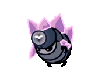 |  | 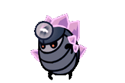 |  | 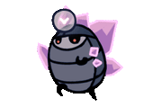 |  |

### Boss — False Knight

| Phase | Idle | Mace Slam | Charge Run | Offensive Leap | Defensive Leap | Stun | Death |
|---|---|---|---|---|---|---|---|
| **Phase 1** |  |  | 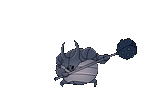 | 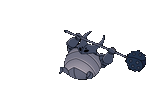 |  | 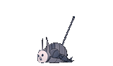 |  |
| **Phase 2** |  | 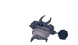 |  |  | 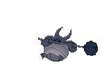 |  | 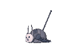 |

### NPC

| NPC | Idle | Dialogue | Attack | Death |
|---|---|---|---|---|
| **Zote** | 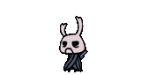 | 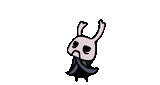 | 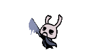 | 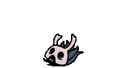 |

---

## 🗺️ Maps

| Map | Theme | Enemies | Music |
|---|---|---|---|
| **Crystal Peaks** | Crystalline caverns | Crawlid, Tiktik, CrystalCrawler, Crystal Guardian | CrystalPeaks.mp3 |
| **City of Tears** | Gothic rain city | Husk Hornhead, Winged Sentry | CityOfTears.mp3 |
| **Boss Arena** | Combat arena | False Knight (Boss) | BossFite.mp3 |

Maps are built with **Tiled** (orthogonal, 8×8 tiles) and loaded via `TmxMapLoader`. Each map contains 7+ layers: background tiles, ground collision, spikes, entity spawns, sensor triggers, and foreground overlays.

**Map Transitions**: Touching a teleport sensor triggers a seamless map change with state preservation.

---

## 💎 Charm System

| Charm | Icon | Effect |
|---|---|---|
| **Quick Slash** | ⚔️ | Attack speed ×2 |
| **Heavy Blow** | 🔨 | Knockback force +5 |
| **Unbreakable Strength** | 💪 | Damage +5 per hit |
| **Sharp Shadow** | 🌑 | Dash becomes Shadow Dash (damages enemies, passes through) |
| **Quick Focus** | 💚 | Heal speed ×2 |
| **Void Heart** | 🖤 | Soul spells → Shadow spells (1.5× damage) |
| **Dashmaster** | 🦅 | Dash cooldown: 1s → 0.1s |

---

## ❤️ HUD System

- **Heart Icons**: 4-state animation machine (`FILLED → BREAKING → EMPTY → REFILLING → FILLED`) with smooth transitions
- **Soul Meter**: FrameBuffer-based liquid fill effect for the soul vessel
- **Soul Accumulation**: Gains 1 soul per melee hit, 11 souls per kill (up to max 99)
- **Spell Cost**: 33 soul per spell (Vengeful Spirit, Howling Wraiths, Focus)

---

## 💾 Save System

- **JSON Serialization** via `SaveManager` → `GameData` → `saves/slotN.json`
- Saves: current map, knight position, HP, soul, charms, equipped charms, stats
- **3 Save Slots** with UI for load/save
- **Auto-Save** on map transitions

---

## 🛠️ Installation

### Prerequisites
- **Java 21** (JDK)
- **Gradle** (wrapper included)

### Build & Run

```bash
# Clone the repository
git clone https://github.com/YousofRahimzadeh/HollowKnight.git
cd HollowKnight

# Run the game
./gradlew lwjgl3:run

# Build distributable JAR
./gradlew lwjgl3:dist

# Package with construo
./gradlew lwjgl3:construo
```

### Run Native Image (GraalVM)

```bash
# Requires GraalVM with native-image
./gradlew lwjgl3:nativeImage
./build/construo/lwjgl3/result/hollow-knight
```

---

## 🖼️ Screenshots

<div align="center">

| Crystal Peaks | City of Tears | Boss Arena |
|---|---|---|
|  |  |  |

| Main Menu | Inventory | Pause Menu |
|---|---|---|
|  |  |  |

</div>

---

## 🎮 Controls

| Action | Default Key |
|---|---|
| Move Left | A / Left Arrow |
| Move Right | D / Right Arrow |
| Jump | Space |
| Attack | J |
| Look Up | W / Up Arrow |
| Look Down | S / Down Arrow |
| Dash | K |
| Spell (Vengeful Spirit) | L |
| Spell (Howling Wraiths) | L (while looking down) |
| Focus (Heal) | Hold Shift |
| Pause | Escape |
| Inventory | I |

All keys are fully re-bindable via the Settings menu.

---

## 👥 Credits

- **Developer**: [Yousof Rahimzadeh](https://github.com/YousofRahimzadeh)
- **Original Game**: [Hollow Knight](https://www.hollowknight.com/) by Team Cherry
- **Framework**: [libGDX](https://libgdx.com/)
- **Physics**: [Box2D](https://box2d.org/)

---

<div align="center">

### ⭐ Star this repo if you found it impressive!

**Built with ❤️ using Java & libGDX**

</div>
