<div align="center">


### A faithful recreation of Team Cherry's Hollow Knight, built from scratch in Java

[](https://openjdk.org/projects/jdk/21/)
[](https://libgdx.com/)
[](https://libgdx.com/wiki/extensions/box2d)
[](https://gradle.org/)
[](LICENSE)

**[🎬 Video Demo](#)** · **[📥 Download](#-installation)** · **[📖 Docs](#-architecture)** · **[🗺️ Maps](#-maps)**

<!-- 🎬 Replace with a real gameplay clip once you upload it -->
<!--  -->

</div>

---

## 📋 Table of Contents

- [Overview](#-overview)
- [Key Features](#-key-features)
- [Tech Stack](#-tech-stack)
- [Architecture](#-architecture)
- [Design Patterns](#-design-patterns)
- [Knight & Enemies](#-knight--enemies)
- [Maps](#-maps)
- [Charm System](#-charm-system)
- [HUD & Save System](#-hud--save-system)
- [Installation](#-installation)
- [Controls](#-controls)
- [Screenshots](#-screenshots)
- [Credits](#-credits)

---

## 🌟 Overview

A **ground-up recreation** of Hollow Knight's core gameplay in **Java + libGDX** — full Box2D physics, state-machine AI for multiple enemies and a boss, Tiled map integration, a charm system, save/load, English/French localization, and a polished HUD with animated health and soul meters.

The codebase applies **11+ design patterns** in a clean MVC architecture with a modular entity system.

---

## 🎯 Key Features

| Feature | Details |
|---|---|
| **Physics Engine** | Full Box2D — gravity, collisions, sensors, bitmask filtering |
| **State Machine AI** | 60+ states across Knight, 5 enemy types, Boss, NPC, Camera |
| **Boss Fight** | Phase-based False Knight — dynamic attacks, armor removal, stun |
| **Charm System** | 6 equippable charms (Quick Slash, Heavy Blow, Sharp Shadow, etc.) |
| **Spells** | Vengeful Spirit, Howling Wraiths (AOE), Focus (Heal) |
| **Movement** | Pogo bouncing, wall sliding, wall jumping |
| **3 Unique Maps** | Crystal Peaks, City of Tears, Boss Arena |
| **Save System** | JSON save slots with full state serialization |
| **Localization** | English & French, runtime switching |
| **Extras** | Re-bindable keys, achievements, dev cheat console |

---

## 🛠️ Tech Stack

| Layer | Technology |
|---|---|
| Language | Java 21 |
| Framework | libGDX 1.14.2 |
| Physics | Box2D (gdx-box2d) |
| Backend | LWJGL3 3.4.1 |
| Fonts | gdx-freetype |
| UI | TenPatch 5.2.3 |
| Level Design | Tiled (8×8 tiles) |
| Build | Gradle + construo / GraalVM |

---

## 🏗️ Architecture

```
Lwjgl3Launcher → Main (Game) → MainController (Assets)
                     │
        ┌────────────┴────────────┐
    MainScreen                GameScreen
    (Menu/UI)          (GameController · GameSession · GameHUD)
                                    │
                    ┌───────────────┼──────────────┐
                 Knight           Enemies       Projectiles
              (16 states)        (5 types)     (Vengeful, Wave)
                    │               │               │
                    └───────────────┼───────────────┘
                                    │
                              Box2D World
                 (GameContactListener, 9 sub-listeners)
```

**Class Hierarchy**
```
Entitie (Abstract)
├── Knight               — Player (16 states)
├── Enemy (Abstract)
│   ├── GroundEnemy       — Crawlid, Tiktik, CrystalCrawler
│   ├── HuskHornheadEnemy — Aggressive ground enemy
│   ├── WingedSentry      — Flying charger
│   ├── CrystalGuardian   — Ranged laser enemy
│   ├── FalseKnightEnemy  — Boss (2 phases)
│   └── Zote              — NPC with dialogue
└── Projectile (Abstract)
    ├── VengefulProjectile
    └── WaveProjectile
```

---

## 🎨 Design Patterns

11+ patterns, each solving a specific architectural challenge — **Singleton** (GameSession, AudioManager…), **Factory** (EnemyFactory, ProjectileFactory), **State** (60+ states across 8 machines), **Observer** (9-listener contact system), **Template Method** (state base classes), **Decorator** (Knockback wrapping), **Strategy** (charm effects), **Composite** (listener/UI stacks), **Command** (cheat & input handling), **Registry** (enum-based asset/map registries), and a lightweight **Abstract Factory** for UI modals.

> 📄 Full pattern-by-pattern breakdown with file references lives in [`docs/ARCHITECTURE.md`](docs/ARCHITECTURE.md) — split it out to keep this README readable.

---

## ⚔️ Knight — Movements & Abilities

The Knight has **16 distinct states** covering movement, combat, spells, and special abilities. Each state is fully animated with directional variants.

<div align="center">

### Movement & Traversal

| # | Movement | GIF | Description |
|---|---|---|---|
| 1 | **Run** | 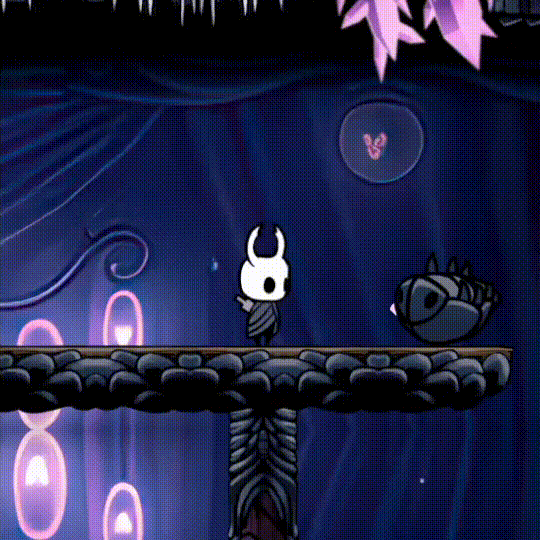 | Horizontal movement with configurable speed |
| 2 | **Double Jump** | 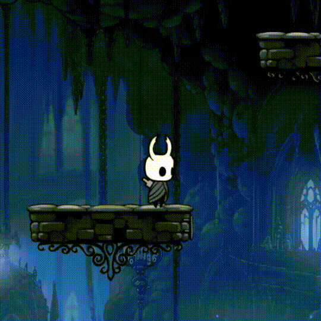 | Second jump in mid-air resets vertical velocity |
| 3 | **Wall Slide** | 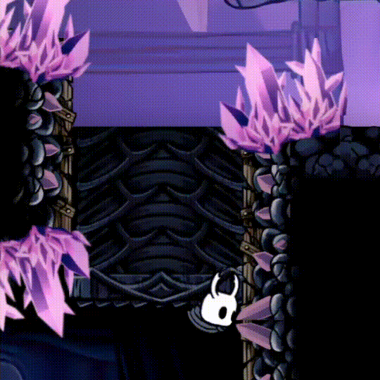 | Slows descent when touching a wall (80% velocity retention) |

### Combat — Melee

| # | Attack | GIF | Description |
|---|---|---|---|
| 4 | **Horizontal Slash** | 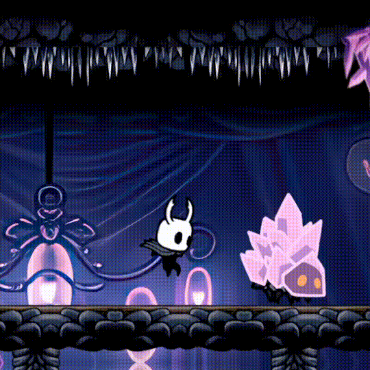 | Forward melee attack (left/right sensor detection) |
| 5 | **Up Slash** | 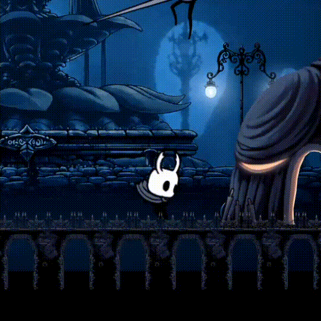 | Upward melee attack (overhead sensor detection) |
| 6 | **Down Slash (Pogo)** | 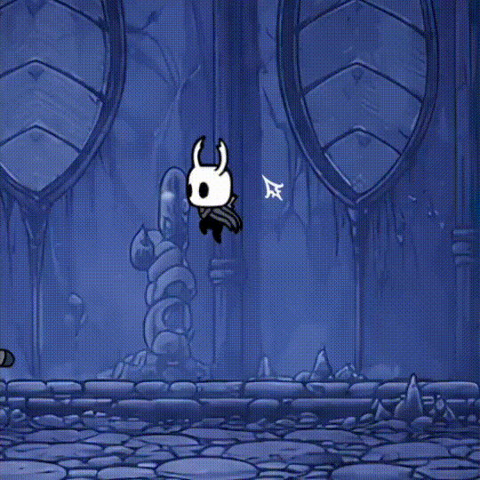 | Downward attack that bounces off enemies/spikes, resets dash & double jump |

### Combat — Dash

| # | Ability | GIF | Description |
|---|---|---|---|
| 7 | **Dash** | 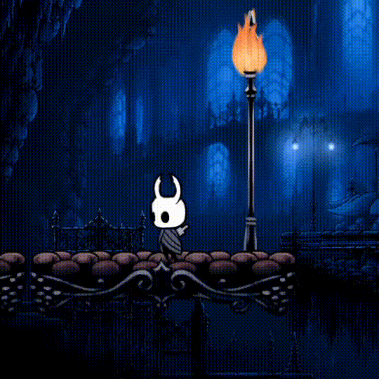 | Quick horizontal burst (impulse ±12), locks Y velocity |
| 8 | **Dash (Dashmaster)** | 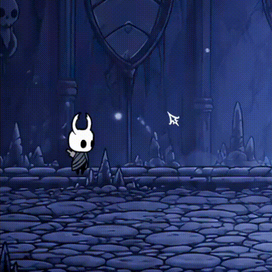 | Dash cooldown 1s → 0.1s with the Dashmaster charm |

### Combat — Spells

| # | Spell | GIF | Description |
|---|---|---|---|
| 9 | **Vengeful Spirit** | 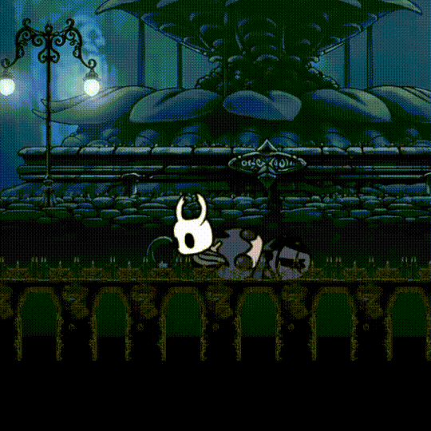 | Horizontal fireball projectile (33 soul) |
| 10 | **Vengeful Spirit (Shadow)** | 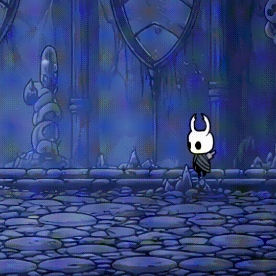 | Void Heart → Shadow version (8 damage, 1.5×) |
| 11 | **Howling Wraiths** | 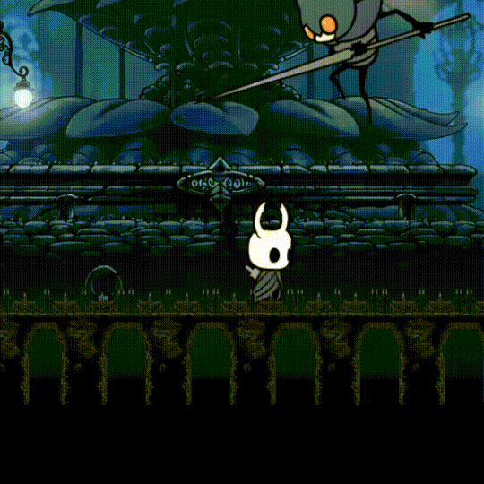 | AOE scream damaging all nearby enemies (33 soul) |
| 12 | **Howling Wraiths (Shadow)** | 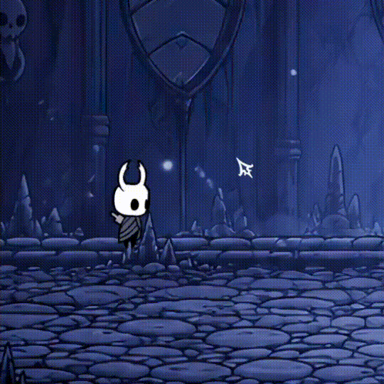 | Void Heart → 1.5× damage |

### NPC

| Character | GIF | Description |
|---|---|---|
| **Zote** | 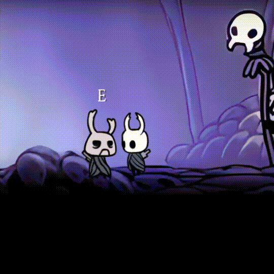 | Talkative NPC with dialogue, killable (20 HP) |

</div>

**False Knight — Phase Transition**: at HP ≤ 50, armor breaks off, speed doubles, and `ChargeMaceSlam` unlocks.

### Enemy Animation Showcase

| Enemy | Idle | Walk | Attack/Charge | Death |
|---|---|---|---|---|
| **Crawlid** |  | 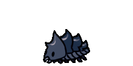 | — | 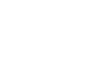 |
| **Husk Hornhead** | 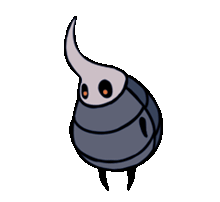 | 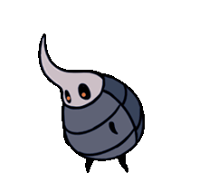 | 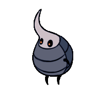 | 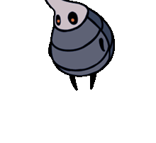 |
| **Winged Sentry** | 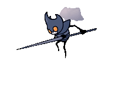 | — | 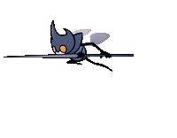 | 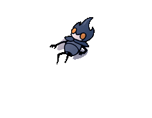 |
| **Crystal Guardian** | 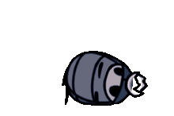 | — | 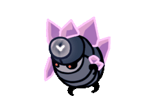 | 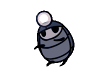 |
| **False Knight** | 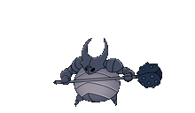 | — | 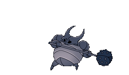 | 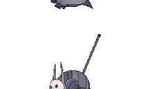 |

> Full animation set (idle/walk/turn/knockback/death per enemy) is in [`docs/ENEMY_ANIMATIONS.md`](docs/ENEMY_ANIMATIONS.md).

---

## 🗺️ Maps

| Map | Theme | Enemies | Music |
|---|---|---|---|
| **Crystal Peaks** | Crystalline caverns | Crawlid, Tiktik, CrystalCrawler, Crystal Guardian | `CrystalPeaks.mp3` |
| **City of Tears** | Gothic rain city | Husk Hornhead, Winged Sentry | `CityOfTears.mp3` |
| **Boss Arena** | Combat arena | False Knight (Boss) | `BossFite.mp3` |

Built with **Tiled** (orthogonal, 8×8 tiles), loaded via `TmxMapLoader`, 7+ layers per map. Teleport sensors trigger seamless map transitions with state preservation.

<div align="center">

| Crystal Peaks | City of Tears | Boss Arena |
|---|---|---|
| 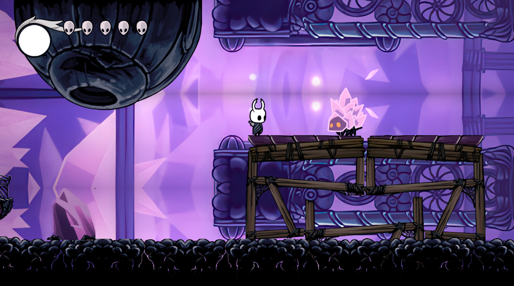 | 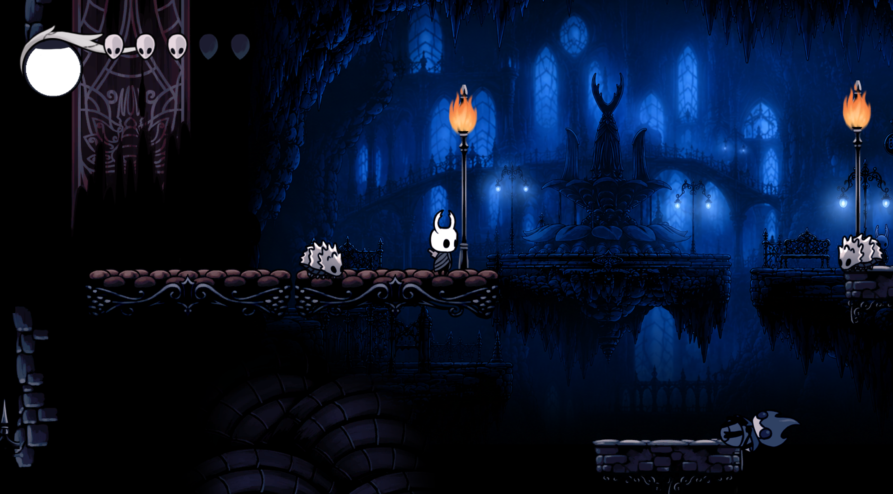 | 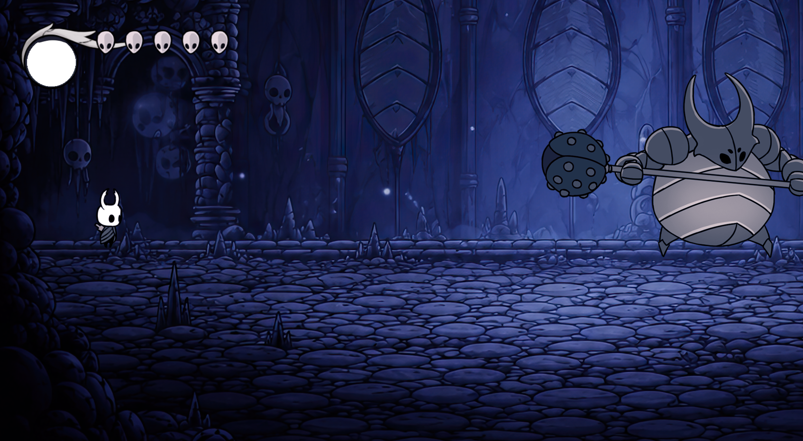 |

</div>

<!-- 🖼️ Map screenshots below in the Screenshots section -->

---

## 💎 Charm System

<div align="center">

| Charm | Effect |
|---|---|
|  ⚔️ **Quick Slash** | Attack speed ×2 |
|  🔨 **Heavy Blow** | Knockback force +5 |
|  💪 **Unbreakable Strength** | Damage +5 per hit |
|  🌑 **Sharp Shadow** | Dash → Shadow Dash (damages enemies, passes through) |
|  💚 **Quick Focus** | Heal speed ×2 |
|  🖤 **Void Heart** | Soul spells → Shadow spells (1.5× damage) |
|  🦅 **Dashmaster** | Dash cooldown 1s → 0.1s |
|  💧 **Soul Catcher** | +10 max soul capacity |

</div>

---

## ❤️ HUD & Save System

- **Heart Icons** — 4-state animation (`FILLED → BREAKING → EMPTY → REFILLING`)
- **Soul Meter** — FrameBuffer-based liquid fill
- **Soul** — +1 per hit, +11 per kill (cap 99); spells cost 33 soul
- **Save** — JSON via `SaveManager` → `GameData` → `saves/slotN.json`, 3 slots, auto-save on map transitions

---

## 🛠️ Installation

**Prerequisites:** Java 21 (JDK), Gradle (wrapper included)

```bash
git clone https://github.com/YousofRahimzadeh/HollowKnight.git
cd HollowKnight

./gradlew lwjgl3:run        # Run the game
./gradlew lwjgl3:dist        # Build distributable JAR
./gradlew lwjgl3:construo    # Package with construo
```

**Native image (GraalVM):**
```bash
./gradlew lwjgl3:nativeImage
./build/construo/lwjgl3/result/hollow-knight
```

---

## 🎮 Controls

| Action | Key |
|---|---|
| Move | A/D or ←/→ |
| Jump | Space |
| Attack | J |
| Look Up/Down | W/S or ↑/↓ |
| Dash | K |
| Vengeful Spirit | L |
| Howling Wraiths | L (while looking down) |
| Focus (Heal) | Hold Shift |
| Pause / Inventory | Esc / I |

All keys are re-bindable in Settings.

---

## 🖼️ Screenshots

<div align="center">

| Main Menu | Select Game | Settings | Guide |
|---|---|---|---|
| 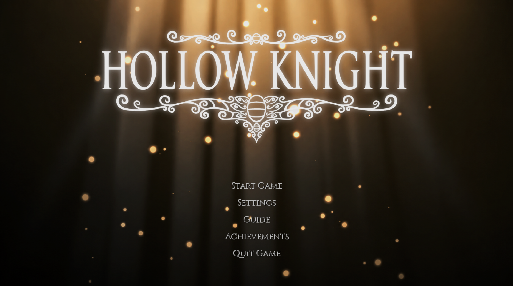 | 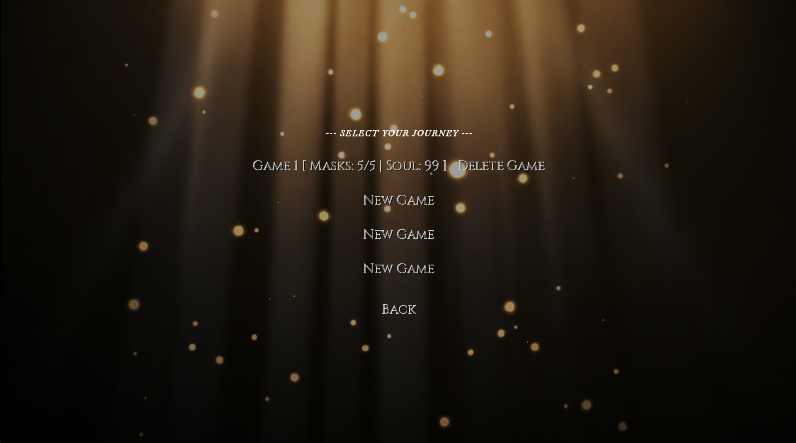 | 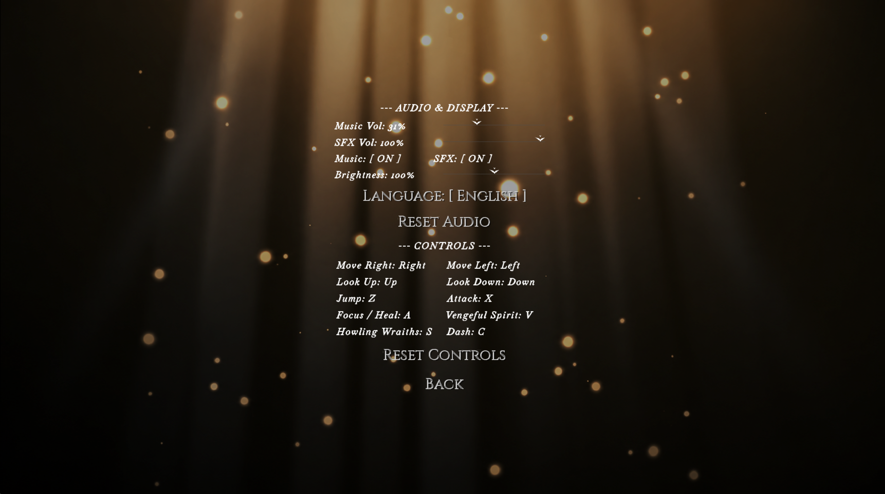 | 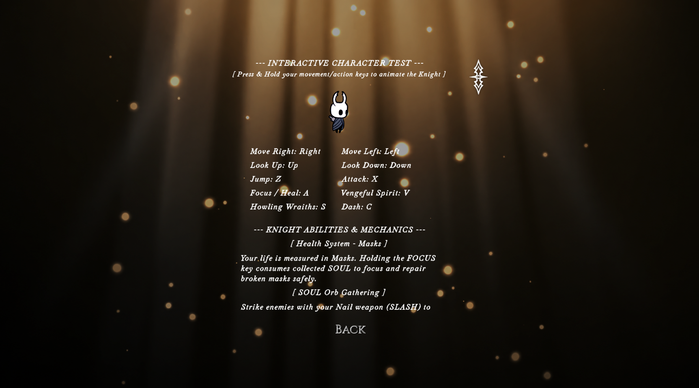 |

</div>

---

## 👥 Credits

- **Developer**: [Yousof Rahimzadeh](https://github.com/YousofRahimzadeh)
- **Original Game**: [Hollow Knight](https://www.hollowknight.com/) by Team Cherry
- **Framework**: [libGDX](https://libgdx.com/) · **Physics**: [Box2D](https://box2d.org/)

---

<div align="center">

### ⭐ Star this repo if you found it impressive!

**Built with ❤️ using Java & libGDX**

</div>
